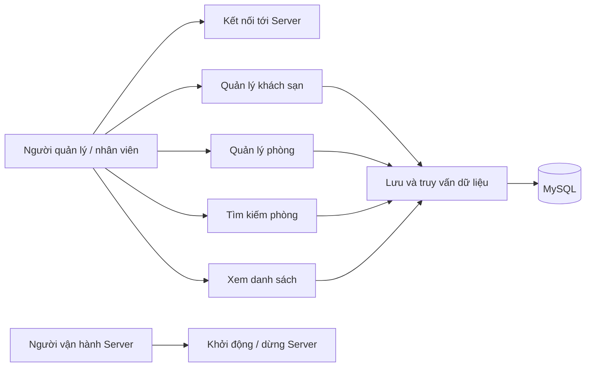
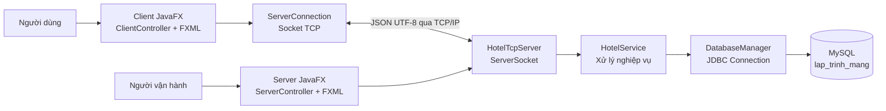
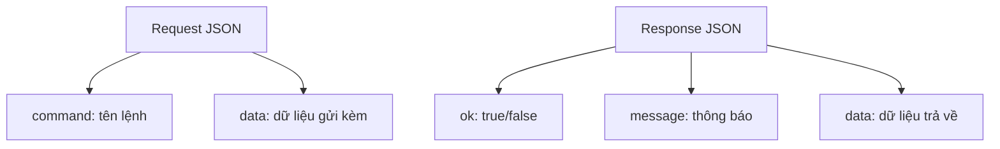
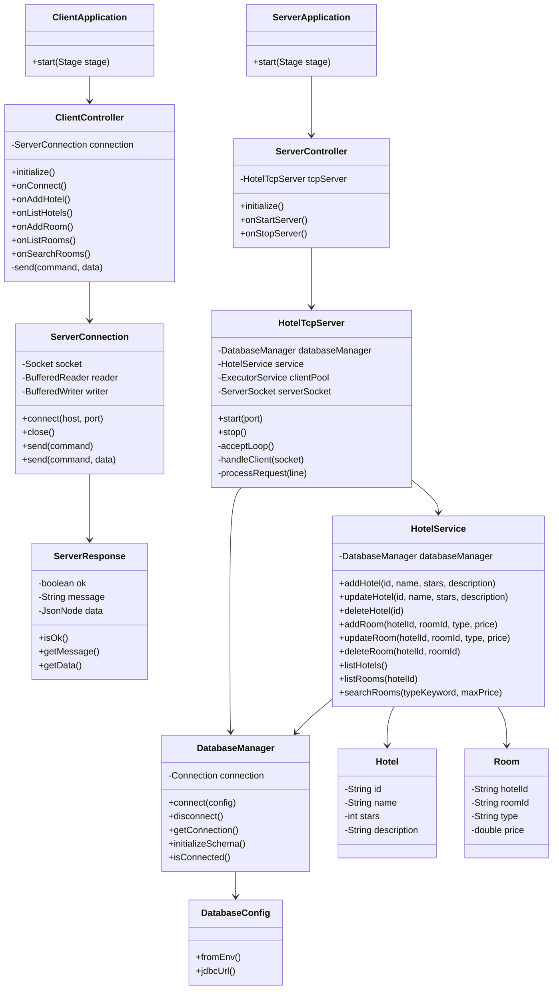
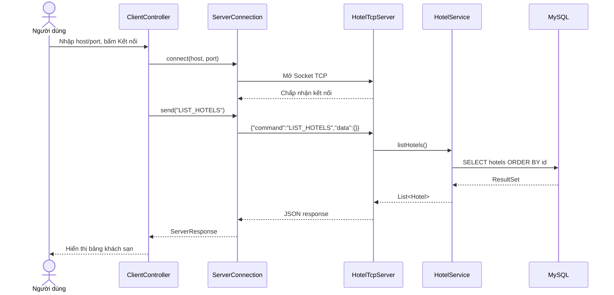
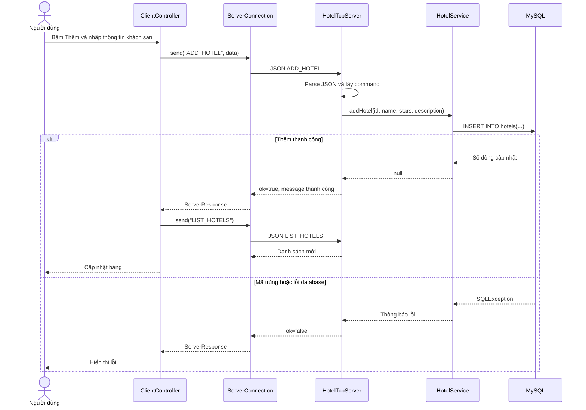
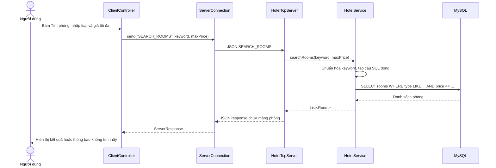
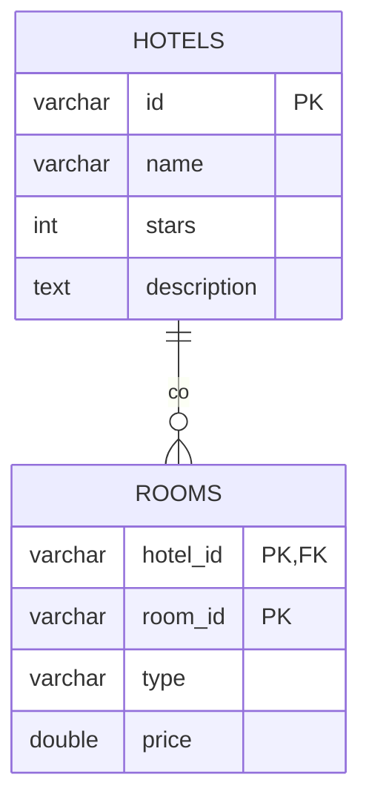
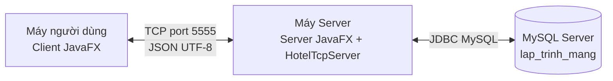

# BÁO CÁO BÀI TẬP LỚN MÔN LẬP TRÌNH MẠNG

## Đề tài: Quản lý khách sạn bằng giao thức TCP/IP

**Họ tên:** Nguyễn Văn Đại  
**MSSV:** K24DTCN0101  
**Lớp:** D24TXCN01-K  
**Môn học:** Lập trình mạng  
**Hình thức báo cáo:** Báo cáo cá nhân  

---

# Mục lục

- [Danh mục từ viết tắt](#danh-mục-từ-viết-tắt)
- [Danh sách hình vẽ](#danh-sách-hình-vẽ)
- [Danh sách bảng biểu](#danh-sách-bảng-biểu)
- [Chương 1. Mở đầu](#chương-1-mở-đầu)
- [Chương 2. Phân tích yêu cầu và use case](#chương-2-phân-tích-yêu-cầu-và-use-case)
- [Chương 3. Thiết kế tổng quan ứng dụng](#chương-3-thiết-kế-tổng-quan-ứng-dụng)
- [Chương 4. Thiết kế chi tiết chức năng cá nhân đảm nhận](#chương-4-thiết-kế-chi-tiết-chức-năng-cá-nhân-đảm-nhận)
- [Chương 5. Cài đặt và triển khai ứng dụng](#chương-5-cài-đặt-và-triển-khai-ứng-dụng)
- [Chương 6. Kết quả thực hiện, thử nghiệm và đánh giá](#chương-6-kết-quả-thực-hiện-thử-nghiệm-và-đánh-giá)
- [Kết luận](#kết-luận)
- [Tài liệu tham khảo](#tài-liệu-tham-khảo)

---

# Danh mục từ viết tắt

| Từ viết tắt | Ý nghĩa |
| --- | --- |
| TCP | Transmission Control Protocol |
| IP | Internet Protocol |
| JSON | JavaScript Object Notation |
| DB | Database |
| JDBC | Java Database Connectivity |
| UI | User Interface |
| CRUD | Create, Read, Update, Delete |
| ER | Entity Relationship |
| FXML | JavaFX XML |

---

# Danh sách hình vẽ

| Số hiệu | Tên hình |
| --- | --- |
| Hình 2.1 | Sơ đồ use case tổng quát của ứng dụng |
| Hình 3.1 | Kiến trúc tổng quan Client - Server - Database |
| Hình 3.2 | Cấu trúc thông điệp TCP dạng JSON |
| Hình 4.1 | Biểu đồ lớp tổng quan |
| Hình 4.2 | Biểu đồ tuần tự: kết nối và lấy danh sách khách sạn |
| Hình 4.3 | Biểu đồ tuần tự: thêm khách sạn |
| Hình 4.4 | Biểu đồ tuần tự: tìm kiếm phòng |
| Hình 4.5 | Sơ đồ thực thể quan hệ ER |
| Hình 5.1 | Mô hình triển khai ứng dụng |

---

# Danh sách bảng biểu

| Số hiệu | Tên bảng |
| --- | --- |
| Bảng 1.1 | Công nghệ sử dụng trong hệ thống |
| Bảng 2.1 | Yêu cầu chức năng |
| Bảng 2.2 | Yêu cầu phi chức năng |
| Bảng 2.3 | Danh sách use case |
| Bảng 3.1 | Danh sách lệnh giao tiếp TCP |
| Bảng 4.1 | Vai trò các lớp chính |
| Bảng 4.2 | Thiết kế bảng `hotels` |
| Bảng 4.3 | Thiết kế bảng `rooms` |
| Bảng 6.1 | Kết quả chức năng đã hoàn thành |
| Bảng 6.2 | Kịch bản thử nghiệm |

---

# Chương 1. Mở đầu

## 1.1. Giới thiệu đề tài

Trong các khách sạn, thông tin về khách sạn và phòng cần được quản lý tập trung để nhân viên có thể tra cứu, thêm mới, cập nhật và xóa dữ liệu khi cần thiết. Nếu dữ liệu chỉ được lưu cục bộ trên một máy, việc chia sẻ thông tin giữa nhiều người dùng sẽ khó khăn. Vì vậy, mô hình Client - Server là lựa chọn phù hợp: Client cung cấp giao diện thao tác cho người dùng, Server xử lý nghiệp vụ và quản lý dữ liệu tập trung.

Đề tài **Quản lý khách sạn bằng giao thức TCP/IP** xây dựng một ứng dụng desktop JavaFX gồm hai chương trình riêng: chương trình Client và chương trình Server. Client kết nối tới Server qua socket TCP. Dữ liệu trao đổi giữa hai bên được đóng gói dưới dạng JSON, mỗi thông điệp kết thúc bằng ký tự xuống dòng. Server nhận yêu cầu, xử lý nghiệp vụ, truy vấn cơ sở dữ liệu MySQL rồi trả lại phản hồi cho Client.

## 1.2. Mục tiêu của ứng dụng

Ứng dụng hướng tới các mục tiêu chính sau:

- Xây dựng được hệ thống Client - Server sử dụng giao thức TCP/IP.
- Cho phép người dùng quản lý danh sách khách sạn và danh sách phòng.
- Lưu trữ dữ liệu bền vững trong cơ sở dữ liệu MySQL.
- Tổ chức giao diện dễ sử dụng bằng JavaFX.
- Thiết kế thông điệp trao đổi rõ ràng, có thể mở rộng bằng JSON.
- Thể hiện được các nội dung chính của môn Lập trình mạng: socket, server lắng nghe cổng, client kết nối, xử lý nhiều client và truyền nhận dữ liệu qua luồng vào/ra.

## 1.3. Phạm vi cá nhân thực hiện

Trong phạm vi báo cáo cá nhân, sinh viên tập trung phân tích, thiết kế và cài đặt các phần sau:

- Giao diện Client cho phép kết nối tới Server, nhập dữ liệu, hiển thị bảng khách sạn/phòng và xem log kết quả.
- Giao diện Server cho phép nhập cổng, khởi động/dừng server và xem log kết nối.
- Giao tiếp TCP giữa Client và Server bằng `Socket` và `ServerSocket`.
- Định dạng giao thức ứng dụng bằng JSON gồm trường `command` và `data`.
- Các chức năng quản lý khách sạn: thêm, sửa, xóa, xem danh sách.
- Các chức năng quản lý phòng: thêm, sửa, xóa, xem danh sách theo khách sạn, tìm kiếm theo loại phòng và giá tối đa.
- Lớp nghiệp vụ xử lý dữ liệu khách sạn/phòng và truy cập MySQL bằng JDBC.
- Thiết kế cơ sở dữ liệu gồm hai thực thể chính: khách sạn và phòng.

## 1.4. Công nghệ sử dụng

**Bảng 1.1. Công nghệ sử dụng trong hệ thống**

| Thành phần | Công nghệ | Vai trò |
| --- | --- | --- |
| Ngôn ngữ lập trình | Java 21 | Cài đặt Client, Server và xử lý nghiệp vụ |
| Giao diện | JavaFX 21.0.6, FXML | Xây dựng giao diện desktop |
| Giao tiếp mạng | TCP/IP Socket | Truyền yêu cầu và phản hồi giữa Client và Server |
| Định dạng dữ liệu | JSON | Đóng gói lệnh, dữ liệu gửi/nhận |
| Thư viện JSON | Jackson Databind 2.19.0 | Chuyển đổi giữa Java object và JSON |
| Cơ sở dữ liệu | MySQL | Lưu trữ khách sạn và phòng |
| Truy cập dữ liệu | JDBC, MySQL Connector/J 9.3.0 | Kết nối và thao tác cơ sở dữ liệu |
| Quản lý build | Maven | Quản lý dependency, biên dịch và chạy chương trình |

## 1.5. Ý nghĩa của đề tài

Đề tài giúp vận dụng các kiến thức quan trọng của môn Lập trình mạng vào một bài toán thực tế. Thông qua việc xây dựng ứng dụng quản lý khách sạn, sinh viên hiểu rõ hơn về cách một Server lắng nghe kết nối, cách Client gửi yêu cầu, cách thiết kế giao thức truyền dữ liệu, cách xử lý nhiều kết nối đồng thời và cách kết hợp giữa tầng mạng với tầng lưu trữ dữ liệu.

---

# Chương 2. Phân tích yêu cầu và use case

## 2.1. Đối tượng sử dụng

Ứng dụng có các đối tượng tham gia chính:

- **Người quản lý/nhân viên khách sạn:** sử dụng Client để thao tác dữ liệu khách sạn và phòng.
- **Người vận hành Server:** mở chương trình Server, nhập cổng, khởi động hoặc dừng dịch vụ.
- **Hệ quản trị cơ sở dữ liệu MySQL:** lưu trữ dữ liệu khách sạn và phòng, phục vụ truy vấn từ Server.

Trong phạm vi bài tập lớn, ứng dụng chưa phân quyền tài khoản người dùng. Vì vậy, người dùng Client được xem như một người quản lý có quyền thao tác toàn bộ dữ liệu.

## 2.2. Yêu cầu chức năng

**Bảng 2.1. Yêu cầu chức năng**

| Mã | Yêu cầu | Mô tả |
| --- | --- | --- |
| F01 | Khởi động Server | Người vận hành nhập cổng và khởi động Server để lắng nghe kết nối TCP |
| F02 | Kết nối Client | Client nhập host, port và kết nối tới Server |
| F03 | Thêm khách sạn | Người dùng nhập mã khách sạn, tên, số sao, mô tả để thêm mới |
| F04 | Sửa khách sạn | Người dùng cập nhật tên, số sao, mô tả của khách sạn đã có |
| F05 | Xóa khách sạn | Người dùng xóa khách sạn khi khách sạn không còn phòng |
| F06 | Xem danh sách khách sạn | Client yêu cầu Server trả về toàn bộ danh sách khách sạn |
| F07 | Thêm phòng | Người dùng chọn khách sạn, nhập mã phòng, loại phòng, giá phòng |
| F08 | Sửa phòng | Người dùng cập nhật loại phòng và giá phòng |
| F09 | Xóa phòng | Người dùng xóa một phòng thuộc khách sạn |
| F10 | Xem danh sách phòng | Người dùng xem phòng theo khách sạn hoặc xem tất cả phòng |
| F11 | Tìm kiếm phòng | Người dùng tìm phòng theo loại phòng và giá tối đa |
| F12 | Ghi log kết quả | Client và Server hiển thị trạng thái xử lý, lỗi kết nối và thông báo nghiệp vụ |

## 2.3. Yêu cầu phi chức năng

**Bảng 2.2. Yêu cầu phi chức năng**

| Mã | Yêu cầu | Mô tả |
| --- | --- | --- |
| NF01 | Đơn giản, dễ sử dụng | Giao diện chia tab Khách sạn và Phòng, thao tác bằng nút và popup |
| NF02 | Dữ liệu tập trung | Dữ liệu được lưu ở MySQL, Client không lưu dữ liệu lâu dài |
| NF03 | Giao tiếp rõ ràng | Yêu cầu/phản hồi dùng JSON, dễ đọc và dễ mở rộng |
| NF04 | Hỗ trợ nhiều client | Server dùng `ExecutorService` để xử lý các client bằng nhiều luồng |
| NF05 | An toàn dữ liệu cơ bản | Truy vấn SQL dùng `PreparedStatement`, hạn chế lỗi chèn SQL |
| NF06 | Dễ cấu hình | Thông tin database có thể lấy từ biến môi trường |
| NF07 | Phản hồi lỗi | Server trả thông báo khi lệnh sai, JSON sai hoặc dữ liệu không hợp lệ |

## 2.4. Sơ đồ use case tổng quát

**Hình 2.1. Sơ đồ use case tổng quát của ứng dụng**



## 2.5. Danh sách use case

**Bảng 2.3. Danh sách use case**

| Mã use case | Tên use case | Tác nhân chính | Kết quả |
| --- | --- | --- | --- |
| UC01 | Khởi động Server | Người vận hành Server | Server lắng nghe ở cổng được nhập |
| UC02 | Kết nối Client | Người quản lý | Client tạo socket tới Server thành công |
| UC03 | Quản lý khách sạn | Người quản lý | Dữ liệu khách sạn được thêm/sửa/xóa/xem |
| UC04 | Quản lý phòng | Người quản lý | Dữ liệu phòng được thêm/sửa/xóa/xem |
| UC05 | Tìm kiếm phòng | Người quản lý | Danh sách phòng phù hợp điều kiện được hiển thị |
| UC06 | Xử lý lỗi giao tiếp | Client/Server | Người dùng nhận thông báo lỗi phù hợp |

## 2.6. Đặc tả use case UC01 - Khởi động Server

| Thuộc tính | Nội dung |
| --- | --- |
| Tên use case | Khởi động Server |
| Tác nhân | Người vận hành Server |
| Tiền điều kiện | Máy có Java 21, MySQL đang hoạt động, cấu hình database hợp lệ |
| Luồng chính | Mở ứng dụng Server; nhập cổng, mặc định là `5555`; bấm nút Khởi động; Server kết nối database; Server tạo `ServerSocket`; Server ghi log đang lắng nghe |
| Luồng ngoại lệ | Port không hợp lệ; port đã được sử dụng; database không kết nối được |
| Hậu điều kiện | Server sẵn sàng nhận kết nối TCP từ Client |

## 2.7. Đặc tả use case UC02 - Kết nối Client

| Thuộc tính | Nội dung |
| --- | --- |
| Tên use case | Kết nối Client |
| Tác nhân | Người quản lý |
| Tiền điều kiện | Server đã được khởi động |
| Luồng chính | Người dùng nhập host và port; bấm Kết nối; Client tạo `Socket`; tạo luồng đọc/ghi UTF-8; Client tự động lấy danh sách khách sạn và phòng |
| Luồng ngoại lệ | Sai host, sai port, Server chưa chạy hoặc kết nối bị đóng |
| Hậu điều kiện | Client có thể gửi các lệnh nghiệp vụ tới Server |

## 2.8. Đặc tả use case UC03 - Quản lý khách sạn

| Thuộc tính | Nội dung |
| --- | --- |
| Tên use case | Quản lý khách sạn |
| Tác nhân | Người quản lý |
| Tiền điều kiện | Client đã kết nối Server |
| Luồng thêm | Bấm Thêm; nhập mã khách sạn, tên, số sao, mô tả; Client gửi `ADD_HOTEL`; Server kiểm tra mã và thêm vào bảng `hotels`; Client làm mới danh sách |
| Luồng sửa | Chọn dòng khách sạn; bấm Sửa; cập nhật thông tin; Client gửi `UPDATE_HOTEL`; Server cập nhật dữ liệu |
| Luồng xóa | Chọn dòng khách sạn; bấm Xóa; xác nhận; Client gửi `DELETE_HOTEL`; Server kiểm tra khách sạn không còn phòng rồi xóa |
| Luồng xem | Bấm Danh sách; Client gửi `LIST_HOTELS`; Server trả mảng khách sạn |
| Ngoại lệ | Mã khách sạn trống, mã bị trùng, không tìm thấy khách sạn, khách sạn còn phòng nên không được xóa |
| Hậu điều kiện | Bảng khách sạn trên Client phản ánh dữ liệu mới nhất từ Server |

## 2.9. Đặc tả use case UC04 - Quản lý phòng

| Thuộc tính | Nội dung |
| --- | --- |
| Tên use case | Quản lý phòng |
| Tác nhân | Người quản lý |
| Tiền điều kiện | Client đã kết nối Server và đã có ít nhất một khách sạn |
| Luồng thêm | Bấm Thêm; chọn khách sạn; nhập mã phòng, loại phòng, giá; Client gửi `ADD_ROOM`; Server kiểm tra khách sạn tồn tại rồi thêm phòng |
| Luồng sửa | Chọn dòng phòng; bấm Sửa; cập nhật loại phòng/giá; Client gửi `UPDATE_ROOM`; Server cập nhật bảng `rooms` |
| Luồng xóa | Chọn dòng phòng; bấm Xóa; xác nhận; Client gửi `DELETE_ROOM`; Server xóa phòng tương ứng |
| Luồng xem | Chọn khách sạn và bấm Danh sách; Client gửi `LIST_ROOMS`; nếu chọn tất cả thì Client dùng `SEARCH_ROOMS` với bộ lọc rỗng |
| Ngoại lệ | Không tìm thấy khách sạn, phòng bị trùng, không tìm thấy phòng, giá nhập sai định dạng |
| Hậu điều kiện | Bảng phòng trên Client được cập nhật theo dữ liệu Server |

## 2.10. Đặc tả use case UC05 - Tìm kiếm phòng

| Thuộc tính | Nội dung |
| --- | --- |
| Tên use case | Tìm kiếm phòng |
| Tác nhân | Người quản lý |
| Tiền điều kiện | Client đã kết nối Server |
| Luồng chính | Người dùng bấm Tìm phòng; nhập loại phòng và giá tối đa; Client gửi `SEARCH_ROOMS`; Server truy vấn bảng `rooms`; Client hiển thị kết quả |
| Luồng thay thế | Nếu bỏ trống giá tối đa, Client gửi `maxPrice = -1` để hiểu là không giới hạn giá |
| Ngoại lệ | Không tìm thấy phòng phù hợp; dữ liệu giá không đúng định dạng số |
| Hậu điều kiện | Người dùng nhìn thấy danh sách phòng phù hợp điều kiện tìm kiếm |

---

# Chương 3. Thiết kế tổng quan ứng dụng

## 3.1. Kiến trúc tổng quan

Ứng dụng được thiết kế theo mô hình Client - Server. Client chỉ chịu trách nhiệm giao diện, thu thập dữ liệu nhập từ người dùng và hiển thị kết quả. Server là nơi tiếp nhận lệnh, kiểm tra nghiệp vụ và thao tác với cơ sở dữ liệu. Database MySQL đóng vai trò lưu trữ dữ liệu tập trung.

**Hình 3.1. Kiến trúc tổng quan Client - Server - Database**



Kiến trúc trên có các ưu điểm:

- Tách giao diện Client khỏi xử lý nghiệp vụ Server.
- Dữ liệu lưu tập trung, Client không cần biết chi tiết cấu trúc database.
- Giao thức JSON giúp thêm lệnh mới dễ dàng.
- Server có thể xử lý nhiều kết nối nhờ thread pool.

## 3.2. Thiết kế giao tiếp TCP/IP

Client tạo kết nối tới Server bằng `Socket(host, port)`. Server dùng `ServerSocket(port)` để lắng nghe. Khi có client kết nối, Server đưa socket client vào `ExecutorService` để xử lý trong một luồng riêng.

Hai bên trao đổi dữ liệu theo cơ chế:

- Mỗi yêu cầu là một chuỗi JSON trên một dòng.
- Client ghi JSON vào `BufferedWriter`, gọi `newLine()` rồi `flush()`.
- Server đọc bằng `BufferedReader.readLine()`.
- Server xử lý và trả về một dòng JSON phản hồi.
- Cả hai phía sử dụng UTF-8 để hỗ trợ tiếng Việt.

**Hình 3.2. Cấu trúc thông điệp TCP dạng JSON**



Ví dụ yêu cầu thêm khách sạn:

```json
{
  "command": "ADD_HOTEL",
  "data": {
    "id": "KS01",
    "name": "Khách sạn Hà Nội",
    "stars": "4",
    "description": "Gần trung tâm"
  }
}
```

Ví dụ phản hồi thành công:

```json
{
  "ok": true,
  "message": "Thêm khách sạn thành công",
  "data": {}
}
```

Ví dụ phản hồi danh sách khách sạn:

```json
{
  "ok": true,
  "message": "Lấy danh sách khách sạn thành công",
  "data": [
    {
      "id": "KS01",
      "name": "Khách sạn Hà Nội",
      "stars": 4,
      "description": "Gần trung tâm"
    }
  ]
}
```

## 3.3. Danh sách lệnh TCP

**Bảng 3.1. Danh sách lệnh giao tiếp TCP**

| Lệnh | Dữ liệu gửi | Dữ liệu trả về | Chức năng |
| --- | --- | --- | --- |
| `ADD_HOTEL` | `id`, `name`, `stars`, `description` | `{}` | Thêm khách sạn |
| `UPDATE_HOTEL` | `id`, `name`, `stars`, `description` | `{}` | Cập nhật khách sạn |
| `DELETE_HOTEL` | `id` | `{}` | Xóa khách sạn |
| `LIST_HOTELS` | Không bắt buộc | Mảng khách sạn | Lấy danh sách khách sạn |
| `ADD_ROOM` | `hotelId`, `roomId`, `type`, `price` | `{}` | Thêm phòng |
| `UPDATE_ROOM` | `hotelId`, `roomId`, `type`, `price` | `{}` | Cập nhật phòng |
| `DELETE_ROOM` | `hotelId`, `roomId` | `{}` | Xóa phòng |
| `LIST_ROOMS` | `hotelId` | Mảng phòng | Lấy danh sách phòng của một khách sạn |
| `SEARCH_ROOMS` | `keyword`, `maxPrice` | Mảng phòng | Tìm phòng theo loại và giá tối đa |

## 3.4. Thiết kế giao diện Client

Giao diện Client được xây dựng bằng JavaFX và FXML. Các thành phần chính gồm:

- Vùng nhập `Host` và `Port`.
- Nút `Kết nối` để tạo socket tới Server.
- Tab `Khách sạn` gồm nút `Thêm`, `Danh sách` và bảng hiển thị khách sạn.
- Tab `Phòng` gồm combo box chọn khách sạn, nút `Thêm`, `Danh sách`, `Tìm phòng` và bảng hiển thị phòng.
- Cột thao tác trong bảng gồm nút `Sửa` và `Xóa`.
- Vùng `TextArea` để in thông báo phản hồi từ Server.

Các form nhập dữ liệu được mở bằng `Dialog`, giúp giao diện chính gọn và hạn chế nhập dữ liệu trực tiếp trong bảng.

## 3.5. Thiết kế giao diện Server

Giao diện Server cũng được xây dựng bằng JavaFX. Các thành phần chính gồm:

- Trường nhập cổng, mặc định là `5555`.
- Nút `Khởi động` để tạo `HotelTcpServer`.
- Nút `Dừng` để đóng `ServerSocket`, dừng thread pool và ngắt kết nối database.
- Vùng log hiển thị thời điểm khởi động, kết nối database, client kết nối/ngắt kết nối và lỗi phát sinh.

## 3.6. Luồng xử lý tổng quát

Luồng hoạt động của hệ thống như sau:

1. Người vận hành mở Server, nhập port và bấm khởi động.
2. Server đọc cấu hình database, kết nối MySQL và tạo schema nếu chưa có.
3. Server tạo `ServerSocket` và bắt đầu lắng nghe client.
4. Người dùng mở Client, nhập host/port và kết nối.
5. Client gửi lệnh JSON tới Server theo thao tác người dùng.
6. Server phân tích JSON, xác định `command`, gọi hàm nghiệp vụ tương ứng.
7. `HotelService` truy vấn hoặc cập nhật MySQL qua `PreparedStatement`.
8. Server trả JSON phản hồi cho Client.
9. Client đọc phản hồi, in thông báo và cập nhật bảng dữ liệu.

---

# Chương 4. Thiết kế chi tiết chức năng cá nhân đảm nhận

## 4.1. Vai trò các lớp chính

**Bảng 4.1. Vai trò các lớp chính**

| Lớp | Thuộc module | Vai trò |
| --- | --- | --- |
| `ClientApplication` | Client | Khởi tạo JavaFX stage, nạp FXML giao diện Client |
| `ClientController` | Client | Điều khiển giao diện Client, xử lý nút bấm, form, bảng dữ liệu |
| `ServerConnection` | Client | Quản lý socket, gửi request JSON và đọc response JSON |
| `ServerResponse` | Client | Đóng gói phản hồi gồm `ok`, `message`, `data` |
| `ClientController.HotelRow` | Client | Model hiển thị một dòng khách sạn trên `TableView` |
| `ClientController.RoomRow` | Client | Model hiển thị một dòng phòng trên `TableView` |
| `ServerApplication` | Server | Khởi tạo JavaFX stage, nạp FXML giao diện Server |
| `ServerController` | Server | Điều khiển giao diện Server, khởi động/dừng server và ghi log |
| `HotelTcpServer` | Server | Lắng nghe TCP, xử lý client, phân tuyến lệnh JSON |
| `HotelService` | Server | Xử lý nghiệp vụ khách sạn/phòng và truy vấn database |
| `DatabaseManager` | Server | Quản lý kết nối JDBC và khởi tạo bảng dữ liệu |
| `DatabaseConfig` | Server | Đọc cấu hình database từ biến môi trường và tạo JDBC URL |
| `Hotel` | Server | Entity khách sạn |
| `Room` | Server | Entity phòng |
| `ProtocolUtils` | Client/Server | Tiện ích mã hóa/giải mã Base64 và tách chuỗi, hiện chưa phải luồng chính của giao thức JSON |

## 4.2. Biểu đồ lớp

**Hình 4.1. Biểu đồ lớp tổng quan**



## 4.3. Thiết kế xử lý phía Client

`ClientController` là lớp trung tâm ở phía Client. Khi giao diện được khởi tạo, controller thiết lập host mặc định `127.0.0.1`, port mặc định `5555`, cấu hình các cột bảng và hiển thị trạng thái chưa kết nối. Khi người dùng bấm nút `Kết nối`, controller gọi `ServerConnection.connect()`.

Các thao tác thêm/sửa khách sạn hoặc phòng được thực hiện qua popup `Dialog`. Sau khi người dùng nhập dữ liệu, controller đóng gói dữ liệu vào `Map<String, Object>` và gọi `connection.send(command, data)`. Nếu nhận được phản hồi hợp lệ, controller in `message` vào vùng output và làm mới bảng liên quan.

`ServerConnection` chịu trách nhiệm kỹ thuật mạng. Lớp này giữ `Socket`, `BufferedReader` và `BufferedWriter`. Khi gửi lệnh, lớp tạo JSON gồm:

- `command`: tên lệnh nghiệp vụ.
- `data`: dữ liệu gửi kèm.

Sau đó lớp ghi JSON xuống socket và đọc một dòng phản hồi. Phản hồi được parse thành `ServerResponse`.

## 4.4. Thiết kế xử lý phía Server

`HotelTcpServer` là lớp trung tâm của Server. Khi gọi `start(port)`, lớp thực hiện:

1. Đọc cấu hình database từ `DatabaseConfig.fromEnv()`.
2. Kết nối MySQL qua `DatabaseManager.connect()`.
3. Khởi tạo bảng bằng `DatabaseManager.initializeSchema()`.
4. Tạo `ServerSocket(port)`.
5. Tạo thread daemon chạy `acceptLoop()`.

Trong `acceptLoop()`, mỗi client mới được `accept()` và đưa vào `clientPool`. Hàm `handleClient()` đọc từng dòng từ socket, gọi `processRequest()` và ghi phản hồi về client.

`processRequest()` parse JSON, lấy trường `command`, sau đó dùng `switch` để gọi các hàm:

- `addHotel()`
- `updateHotel()`
- `deleteHotel()`
- `listHotels()`
- `addRoom()`
- `updateRoom()`
- `deleteRoom()`
- `listRooms()`
- `searchRooms()`

Mỗi hàm nhận `JsonNode data`, trích xuất dữ liệu, gọi `HotelService` và trả JSON phản hồi. Nếu có lỗi JSON hoặc lỗi xử lý, Server trả phản hồi `ok = false` với thông báo lỗi.

## 4.5. Thiết kế nghiệp vụ và kiểm tra dữ liệu

`HotelService` chứa các quy tắc nghiệp vụ chính:

- Mã khách sạn không được để trống khi thêm.
- Không cho phép thêm khách sạn trùng khóa chính.
- Khi sửa hoặc xóa khách sạn, nếu không tìm thấy khách sạn thì trả thông báo lỗi.
- Chỉ được xóa khách sạn khi khách sạn không còn phòng. Mặc dù database có `ON DELETE CASCADE`, ứng dụng vẫn kiểm tra để tránh xóa nhầm toàn bộ phòng thuộc khách sạn.
- Khi thêm phòng, phải kiểm tra khách sạn tồn tại.
- Khóa chính phòng là cặp `(hotel_id, room_id)`, nên cùng một khách sạn không được có hai phòng trùng mã.
- Khi sửa hoặc xóa phòng, nếu không tìm thấy khách sạn hoặc phòng thì trả thông báo phù hợp.
- Tìm kiếm phòng hỗ trợ lọc theo loại phòng bằng `LOWER(type) LIKE ?` và lọc theo giá tối đa.

Các câu lệnh SQL đều dùng `PreparedStatement`, giúp truyền tham số an toàn hơn so với ghép chuỗi trực tiếp.

## 4.6. Biểu đồ tuần tự

### 4.6.1. Kết nối và lấy danh sách khách sạn

**Hình 4.2. Biểu đồ tuần tự: kết nối và lấy danh sách khách sạn**



### 4.6.2. Thêm khách sạn

**Hình 4.3. Biểu đồ tuần tự: thêm khách sạn**



### 4.6.3. Tìm kiếm phòng

**Hình 4.4. Biểu đồ tuần tự: tìm kiếm phòng**



## 4.7. Thiết kế cơ sở dữ liệu

Ứng dụng sử dụng database `lap_trinh_mang` với hai bảng chính:

- `hotels`: lưu thông tin khách sạn.
- `rooms`: lưu thông tin phòng, mỗi phòng thuộc một khách sạn.

Quan hệ giữa hai bảng là một-nhiều: một khách sạn có thể có nhiều phòng, một phòng thuộc về đúng một khách sạn.

**Hình 4.5. Sơ đồ thực thể quan hệ ER**



**Bảng 4.2. Thiết kế bảng `hotels`**

| Trường | Kiểu dữ liệu | Ràng buộc | Ý nghĩa |
| --- | --- | --- | --- |
| `id` | `VARCHAR(64)` | Primary key | Mã khách sạn |
| `name` | `VARCHAR(255)` | Not null | Tên khách sạn |
| `stars` | `INT` | Not null | Số sao |
| `description` | `TEXT` | Cho phép null | Mô tả khách sạn |

**Bảng 4.3. Thiết kế bảng `rooms`**

| Trường | Kiểu dữ liệu | Ràng buộc | Ý nghĩa |
| --- | --- | --- | --- |
| `hotel_id` | `VARCHAR(64)` | Primary key, foreign key | Mã khách sạn chứa phòng |
| `room_id` | `VARCHAR(64)` | Primary key | Mã phòng trong khách sạn |
| `type` | `VARCHAR(255)` | Not null | Loại phòng |
| `price` | `DOUBLE` | Not null | Giá phòng |

Khóa chính của bảng `rooms` là cặp `(hotel_id, room_id)`. Cách thiết kế này cho phép hai khách sạn khác nhau có thể cùng dùng một mã phòng, nhưng trong cùng một khách sạn thì mã phòng phải duy nhất.

## 4.8. Thiết kế phản hồi lỗi

Server luôn trả về JSON theo cấu trúc thống nhất:

- `ok = true`: xử lý thành công.
- `ok = false`: xử lý thất bại.
- `message`: nội dung thông báo cho người dùng.
- `data`: dữ liệu trả về, có thể là object rỗng hoặc mảng dữ liệu.

Một số tình huống lỗi được xử lý:

- Lệnh rỗng hoặc không hợp lệ.
- JSON gửi lên không đúng định dạng.
- Chưa kết nối database.
- Khách sạn đã tồn tại.
- Phòng đã tồn tại.
- Không tìm thấy khách sạn.
- Không tìm thấy phòng.
- Không được xóa khách sạn khi vẫn còn phòng.

Thiết kế phản hồi thống nhất giúp Client không cần xử lý nhiều định dạng khác nhau. Client chỉ cần đọc `ok`, `message` và `data`.

## 4.9. Thiết kế xử lý đồng thời

Server sử dụng `ExecutorService clientPool = Executors.newCachedThreadPool()` để xử lý nhiều client. Khi một socket mới được chấp nhận, Server tạo tác vụ xử lý riêng cho client đó. Nhờ vậy, một client đang gửi yêu cầu không làm chặn việc chấp nhận hoặc phục vụ client khác.

Các phương thức trong `HotelService` được khai báo `synchronized`. Điều này giúp các thao tác nghiệp vụ với cùng một kết nối database được tuần tự hóa, tránh việc nhiều luồng cùng thao tác đồng thời lên cùng một đối tượng `Connection` trong ứng dụng.

---

# Chương 5. Cài đặt và triển khai ứng dụng

## 5.1. Cấu trúc thư mục

Cấu trúc chính của bài tập lớn:

```text
ltm/btl
├── client
│   ├── pom.xml
│   └── src/main/java/vn/dainv/client
│       ├── ClientApplication.java
│       ├── ClientController.java
│       ├── Launcher.java
│       ├── ProtocolUtils.java
│       ├── ServerConnection.java
│       └── ServerResponse.java
├── server
│   ├── pom.xml
│   ├── schema.sql
│   └── src/main/java/vn/dainv/server
│       ├── DatabaseConfig.java
│       ├── DatabaseManager.java
│       ├── Hotel.java
│       ├── HotelService.java
│       ├── HotelTcpServer.java
│       ├── Launcher.java
│       ├── ProtocolUtils.java
│       ├── Room.java
│       ├── ServerApplication.java
│       └── ServerController.java
└── bao_cao
    ├── requirement.md
    └── bao_cao_btl_lap_trinh_mang.md
```

## 5.2. Yêu cầu môi trường

Máy triển khai cần có:

- JDK 21.
- Maven hoặc Maven Wrapper đi kèm project.
- MySQL Server.
- Database `lap_trinh_mang`.
- Cổng TCP cho Server, mặc định `5555`.

## 5.3. Cài đặt cơ sở dữ liệu

File `server/schema.sql` tạo database và hai bảng cần thiết:

```sql
CREATE DATABASE IF NOT EXISTS lap_trinh_mang
  CHARACTER SET utf8mb4
  COLLATE utf8mb4_unicode_ci;

USE lap_trinh_mang;

CREATE TABLE IF NOT EXISTS hotels (
    id VARCHAR(64) NOT NULL,
    name VARCHAR(255) NOT NULL,
    stars INT NOT NULL,
    description TEXT,
    PRIMARY KEY (id)
);

CREATE TABLE IF NOT EXISTS rooms (
    hotel_id VARCHAR(64) NOT NULL,
    room_id VARCHAR(64) NOT NULL,
    type VARCHAR(255) NOT NULL,
    price DOUBLE NOT NULL,
    PRIMARY KEY (hotel_id, room_id),
    FOREIGN KEY (hotel_id) REFERENCES hotels(id)
);
```

Có thể tạo database bằng lệnh:

```bash
mysql -u root -p < server/schema.sql
```

Ngoài việc chạy file SQL, Server cũng có phương thức `initializeSchema()` để tự tạo bảng `hotels` và `rooms` nếu chưa tồn tại.

## 5.4. Cấu hình database

Server đọc cấu hình database từ biến môi trường:

| Biến môi trường | Ý nghĩa |
| --- | --- |
| `DB_HOST` | Host MySQL |
| `DB_PORT` | Port MySQL |
| `DB_NAME` | Tên database |
| `DB_USER` | Tên người dùng |
| `DB_PASSWORD` | Mật khẩu |

Ví dụ cấu hình trên PowerShell:

```powershell
$env:DB_HOST="127.0.0.1"
$env:DB_PORT="3306"
$env:DB_NAME="lap_trinh_mang"
$env:DB_USER="root"
$env:DB_PASSWORD="<mat_khau_mysql>"
```

Khi không cấu hình biến môi trường, chương trình dùng giá trị mặc định trong `DatabaseConfig`. Khi triển khai thực tế, nên cấu hình bằng biến môi trường để tránh cố định thông tin đăng nhập trong source code.

## 5.5. Chạy Server

Từ thư mục `ltm/btl/server`, chạy:

```bash
mvn exec:java -Dexec.mainClass="vn.dainv.server.Launcher"
```

Các bước thao tác:

1. Mở cửa sổ Server.
2. Nhập port, mặc định `5555`.
3. Bấm `Khởi động`.
4. Kiểm tra vùng log, nếu kết nối database thành công và Server đang lắng nghe thì có thể mở Client.

## 5.6. Chạy Client

Từ thư mục `ltm/btl/client`, chạy:

```bash
mvn exec:java -Dexec.mainClass="vn.dainv.client.Launcher"
```

Các bước thao tác:

1. Mở cửa sổ Client.
2. Nhập host Server, mặc định `127.0.0.1`.
3. Nhập port, mặc định `5555`.
4. Bấm `Kết nối`.
5. Nếu kết nối thành công, Client sẽ tự động tải danh sách khách sạn và danh sách phòng.

## 5.7. Mô hình triển khai

**Hình 5.1. Mô hình triển khai ứng dụng**



Trong môi trường học tập, Client, Server và MySQL có thể chạy trên cùng một máy. Khi triển khai trên nhiều máy, cần đảm bảo:

- Client nhìn thấy địa chỉ IP của máy Server.
- Firewall cho phép kết nối tới port Server.
- Server kết nối được tới MySQL.
- Cấu hình host, port, user, password MySQL đúng.

---

# Chương 6. Kết quả thực hiện, thử nghiệm và đánh giá

## 6.1. Kết quả chức năng đã hoàn thành

**Bảng 6.1. Kết quả chức năng đã hoàn thành**

| Nhóm chức năng | Kết quả |
| --- | --- |
| Khởi động Server | Server có giao diện nhập port, nút khởi động/dừng và vùng log |
| Kết nối Client | Client nhập host/port và kết nối TCP tới Server |
| Quản lý khách sạn | Thêm, sửa, xóa, xem danh sách khách sạn |
| Quản lý phòng | Thêm, sửa, xóa, xem danh sách phòng theo khách sạn |
| Tìm kiếm phòng | Tìm theo loại phòng và giá tối đa |
| Lưu trữ dữ liệu | Dữ liệu được lưu trong MySQL qua JDBC |
| Giao thức truyền dữ liệu | JSON một dòng qua TCP, phản hồi thống nhất `ok`, `message`, `data` |
| Xử lý nhiều client | Server dùng thread pool để phục vụ nhiều socket client |
| Xử lý lỗi | Có thông báo khi lệnh sai, JSON sai, trùng dữ liệu, không tìm thấy dữ liệu hoặc lỗi giao tiếp |

## 6.2. Kịch bản thử nghiệm

**Bảng 6.2. Kịch bản thử nghiệm**

| Mã test | Mục tiêu | Các bước | Kết quả mong muốn |
| --- | --- | --- | --- |
| TC01 | Khởi động Server | Mở Server, nhập `5555`, bấm Khởi động | Log báo kết nối database thành công và đang lắng nghe |
| TC02 | Kết nối Client | Mở Client, nhập `127.0.0.1`, port `5555`, bấm Kết nối | Client báo đã kết nối tới Server |
| TC03 | Thêm khách sạn | Bấm Thêm ở tab Khách sạn, nhập dữ liệu hợp lệ | Server trả thông báo thêm thành công, bảng khách sạn có dòng mới |
| TC04 | Thêm khách sạn trùng mã | Thêm lại khách sạn có cùng mã | Server trả thông báo khách sạn đã tồn tại |
| TC05 | Sửa khách sạn | Bấm Sửa ở một dòng khách sạn, cập nhật tên/số sao/mô tả | Dữ liệu trên bảng được cập nhật |
| TC06 | Thêm phòng | Chọn khách sạn, bấm Thêm phòng, nhập mã phòng/loại/giá | Phòng mới xuất hiện trong bảng phòng |
| TC07 | Thêm phòng cho khách sạn không tồn tại | Gửi dữ liệu phòng với mã khách sạn không tồn tại | Server trả thông báo không tìm thấy khách sạn |
| TC08 | Tìm phòng theo loại | Nhập loại phòng, bỏ trống giá tối đa | Client hiển thị các phòng có loại phù hợp |
| TC09 | Tìm phòng theo giá | Nhập giá tối đa | Client chỉ hiển thị phòng có giá nhỏ hơn hoặc bằng giá tối đa |
| TC10 | Xóa khách sạn còn phòng | Xóa khách sạn đang có phòng | Server không cho xóa và trả thông báo phải xóa hết phòng trước |
| TC11 | Xóa phòng | Chọn phòng và bấm Xóa | Phòng bị xóa khỏi database và bảng được làm mới |
| TC12 | Dừng Server | Bấm Dừng trên Server | Server đóng socket, ngắt database và ghi log đã dừng |

## 6.3. Ví dụ dữ liệu thử nghiệm

Có thể dùng dữ liệu mẫu sau để kiểm thử:

| Khách sạn | Tên | Số sao | Mô tả |
| --- | --- | --- | --- |
| KS01 | Khách sạn Hà Nội | 4 | Gần trung tâm |
| KS02 | Khách sạn Biển Xanh | 5 | Gần biển, có hồ bơi |
| KS03 | Khách sạn Bình Dân | 2 | Giá rẻ, phù hợp nghỉ ngắn ngày |

| Khách sạn | Mã phòng | Loại phòng | Giá |
| --- | --- | --- | --- |
| KS01 | P101 | Standard | 500000 |
| KS01 | P201 | Deluxe | 900000 |
| KS02 | A101 | Suite | 1800000 |
| KS03 | B101 | Single | 300000 |

Với dữ liệu trên, khi tìm kiếm loại phòng `Deluxe`, hệ thống trả về phòng `P201` của `KS01`. Khi tìm với giá tối đa `600000`, hệ thống trả về các phòng có giá không vượt quá 600000.

## 6.4. Đánh giá kết quả

Ứng dụng đã đáp ứng các yêu cầu cơ bản của bài tập lớn môn Lập trình mạng:

- Có mô hình Client - Server rõ ràng.
- Có sử dụng socket TCP để truyền nhận dữ liệu.
- Có giao thức ứng dụng riêng dựa trên JSON.
- Có giao diện cho cả Client và Server.
- Có lưu trữ dữ liệu bằng MySQL.
- Có xử lý nhiều thao tác CRUD và tìm kiếm.
- Có xử lý lỗi nghiệp vụ và lỗi giao tiếp ở mức cơ bản.

Điểm nổi bật của thiết kế là giao thức JSON có cấu trúc thống nhất. Khi cần mở rộng thêm chức năng như quản lý đặt phòng, quản lý khách hàng hoặc đăng nhập, có thể thêm command mới ở `HotelTcpServer` và thêm hàm xử lý tương ứng trong `HotelService`.

## 6.5. Hạn chế

Ứng dụng hiện vẫn còn một số hạn chế:

- Chưa có chức năng đăng nhập và phân quyền người dùng.
- Chưa có nghiệp vụ đặt phòng, trả phòng, quản lý khách hàng.
- Chưa mã hóa kênh truyền TCP, dữ liệu truyền ở dạng JSON thuần.
- Chưa có connection pool cho database.
- Chưa có kiểm tra dữ liệu đầu vào đầy đủ ở phía giao diện, ví dụ giới hạn số sao hoặc giá phải lớn hơn 0.
- Chưa có bộ test tự động cho service và giao thức TCP.
- Giao diện mới ở mức cơ bản, chưa có biểu đồ thống kê hoặc báo cáo doanh thu.

## 6.6. Hướng phát triển

Trong tương lai, ứng dụng có thể được mở rộng theo các hướng:

- Bổ sung đăng nhập, phân quyền quản trị viên và nhân viên.
- Thêm thực thể khách hàng, đặt phòng, hóa đơn, thanh toán.
- Thêm trạng thái phòng: trống, đã đặt, đang sử dụng, bảo trì.
- Dùng connection pool như HikariCP để tăng hiệu năng truy cập database.
- Bổ sung kiểm thử tự động bằng JUnit.
- Mã hóa giao tiếp bằng TLS hoặc chuyển sang HTTPS/WebSocket nếu cần triển khai thực tế.
- Đóng gói ứng dụng thành file cài đặt hoặc file chạy độc lập.

---

# Kết luận

Bài tập lớn **Quản lý khách sạn bằng giao thức TCP/IP** đã xây dựng được một ứng dụng desktop Client - Server hoàn chỉnh ở mức cơ bản. Client cung cấp giao diện thao tác dữ liệu, Server lắng nghe kết nối TCP và xử lý nghiệp vụ, còn MySQL lưu trữ dữ liệu tập trung. Thông qua đề tài, sinh viên đã vận dụng các kiến thức về lập trình socket, truyền nhận dữ liệu qua luồng vào/ra, thiết kế giao thức ứng dụng, xử lý đa luồng phía Server và kết nối cơ sở dữ liệu bằng JDBC.

Kết quả đạt được cho thấy mô hình Client - Server phù hợp với bài toán quản lý dữ liệu tập trung. Dù còn một số hạn chế, cấu trúc hiện tại có khả năng mở rộng tốt nhờ cách tách lớp rõ ràng giữa giao diện, giao tiếp mạng, xử lý nghiệp vụ và lưu trữ dữ liệu.

---

# Tài liệu tham khảo

1. Oracle, *Java Platform Standard Edition Documentation*, https://docs.oracle.com/en/java/
2. OpenJFX, *JavaFX Documentation*, https://openjfx.io/
3. Oracle, *Java Networking*, https://docs.oracle.com/javase/tutorial/networking/
4. FasterXML, *Jackson Databind Documentation*, https://github.com/FasterXML/jackson-databind
5. MySQL, *MySQL 8.0 Reference Manual*, https://dev.mysql.com/doc/
6. Maven, *Apache Maven Documentation*, https://maven.apache.org/guides/
7. Source code bài tập lớn trong thư mục `ltm/btl/client` và `ltm/btl/server`.
