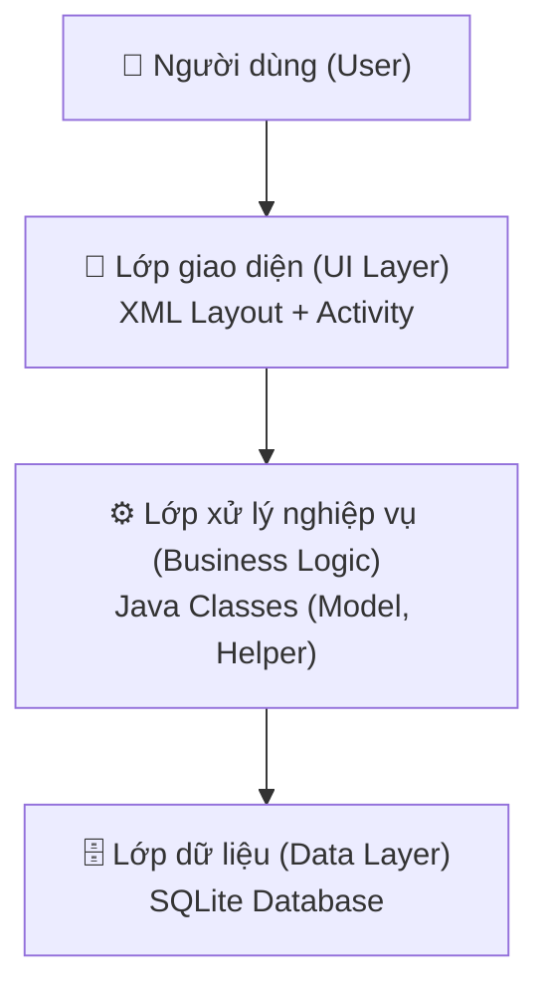
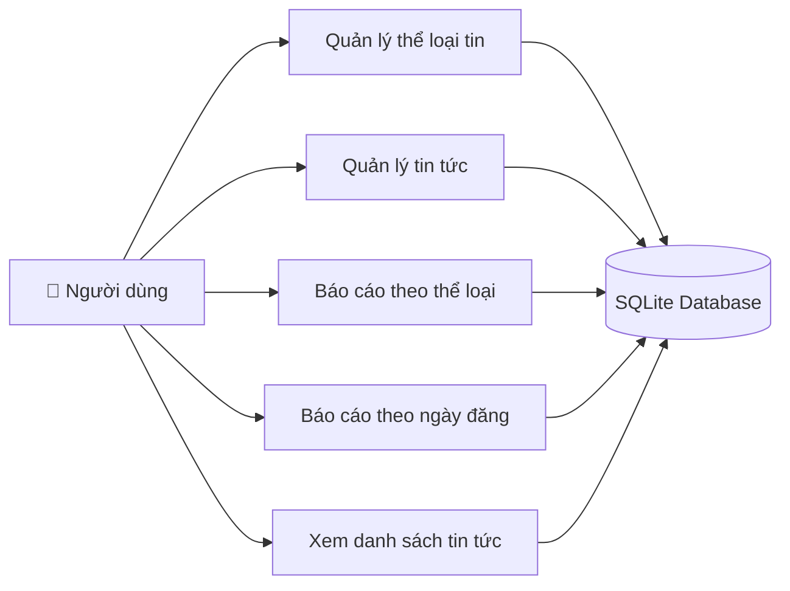
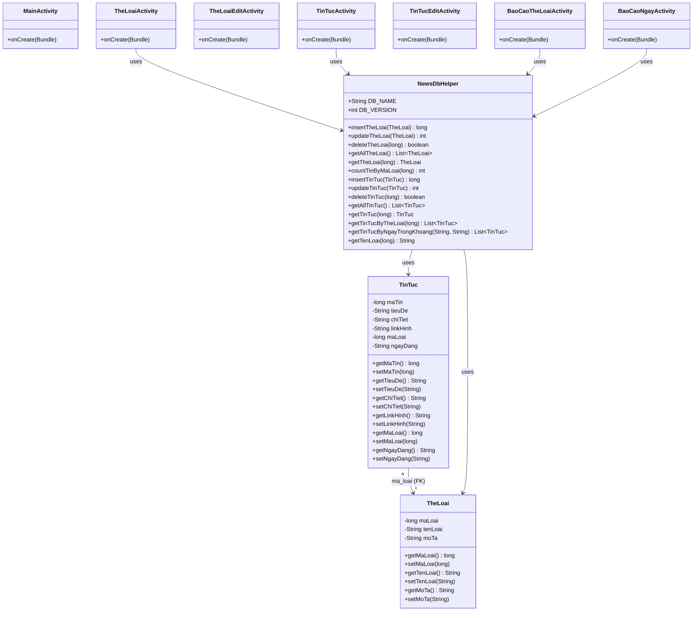
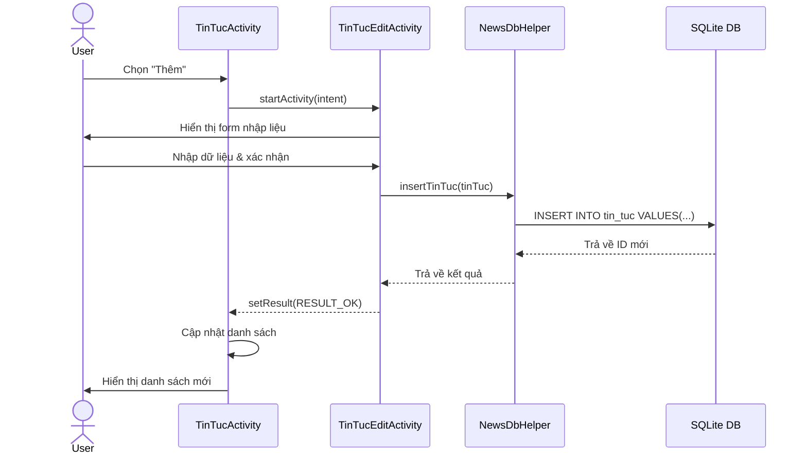
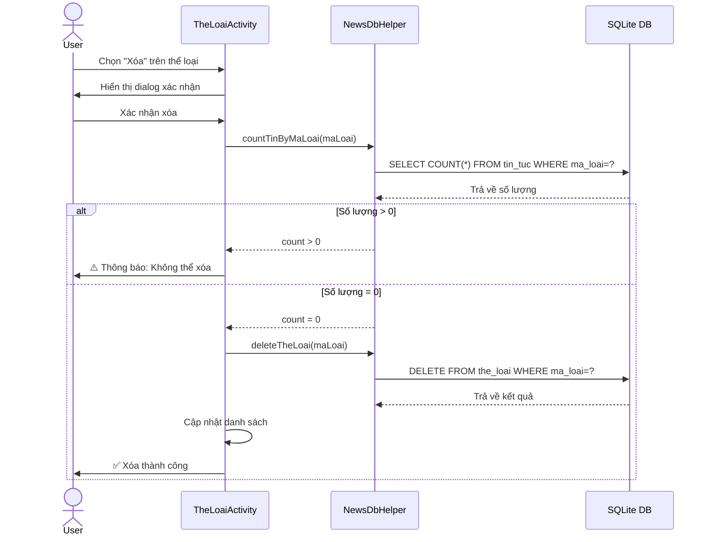
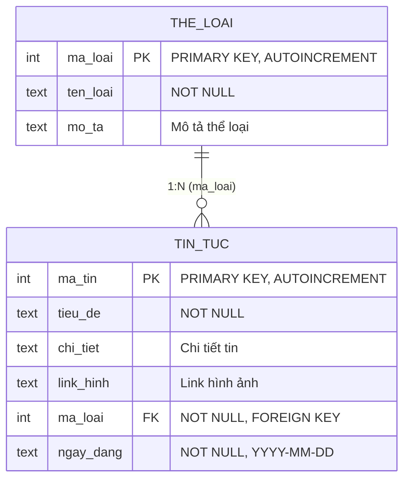
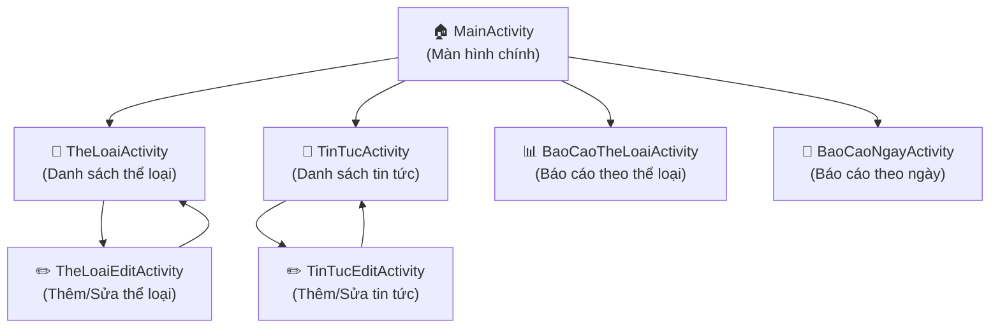
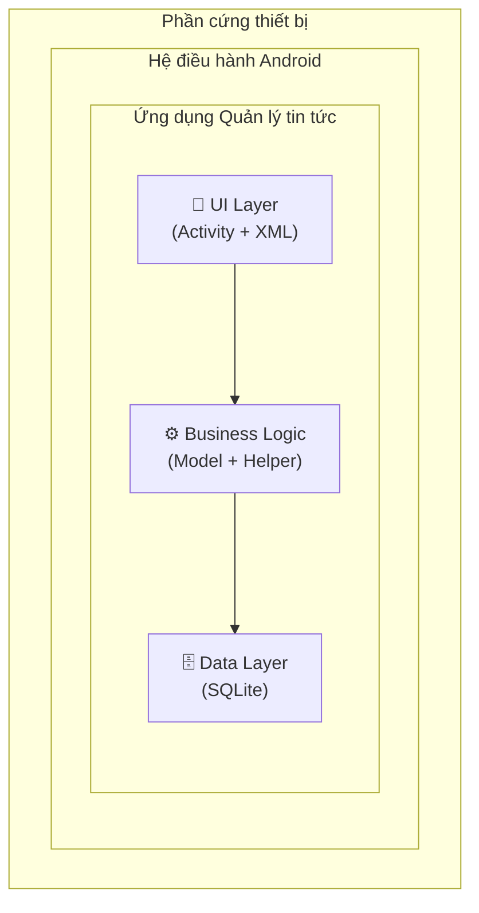
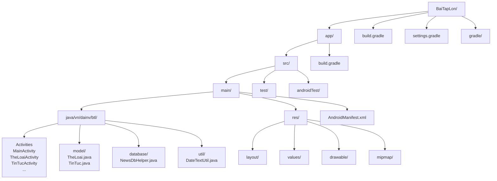

# BÁO CÁO BÀI TẬP LỚN
## Môn học: Lập trình di động

---

**Tên ứng dụng:** Quản lý tin tức
**Ngôn ngữ:** Java
**Nền tảng:** Android

| | |
|---|---|
| Giảng viên hướng dẫn: | .................................................. |
| Sinh viên thực hiện: | .................................................. |
| Mã sinh viên: | .................................................. |
| Lớp: | .................................................. |
| Khoa: | .................................................. |
| Trường: | .................................................. |

---

## MỤC LỤC

1. [Chương 1: Mở đầu](#chương-1-mở-đầu)
2. [Chương 2: Thiết kế ứng dụng](#chương-2-thiết-kế-ứng-dụng)
3. [Chương 3: Kết quả ứng dụng](#chương-3-kết-quả-ứng-dụng)
4. [Kết luận](#kết-luận)
5. [Tài liệu tham khảo](#tài-liệu-tham-khảo)

---

## DANH SÁCH TỪ VIẾT TẮT

| STT | Viết tắt | Nghĩa đầy đủ |
|-----|----------|--------------|
| 1 | BTL | Bài Tập Lớn |
| 2 | UI | User Interface (Giao diện người dùng) |
| 3 | DB | Database (Cơ sở dữ liệu) |
| 4 | CRUD | Create, Read, Update, Delete |
| 5 | ER | Entity Relationship (Thực thể – Quan hệ) |
| 6 | API | Application Programming Interface |
| 7 | SDK | Software Development Kit |
| 8 | XML | Extensible Markup Language |
| 9 | SQLite | Structured Query Language Lite |
| 10 | MVC | Model-View-Controller |

---

## CHƯƠNG 1: MỞ ĐẦU

### 1.1. Giới thiệu ứng dụng

#### 1.1.1. Đặt vấn đề

Trong thời đại công nghệ thông tin phát triển mạnh mẽ, việc tiếp cận thông tin nhanh chóng và chính xác trở nên vô cùng quan trọng. Tin tức là một trong những nguồn thông tin phổ biến nhất, giúp người dùng cập nhật các sự kiện trong nước và quốc tế mỗi ngày. Tuy nhiên, việc quản lý và phân loại tin tức một cách hệ thống vẫn là một thách thức đối với các tổ chức truyền thông và cá nhân.

Ứng dụng **Quản lý tin tức** được xây dựng nhằm cung cấp một công cụ hỗ trợ quản lý tin tức và thể loại tin một cách hiệu quả trên thiết bị di động Android. Ứng dụng cho phép người dùng thực hiện các thao tác CRUD (Thêm, Sửa, Xóa) đối với tin tức và thể loại tin, đồng thời hỗ trợ chức năng báo cáo, truy vấn tin tức theo nhiều tiêu chí khác nhau.

#### 1.1.2. Mục tiêu ứng dụng

Ứng dụng hướng đến các mục tiêu sau:

- Quản lý thể loại tin: Thêm, sửa, xóa các thể loại tin tức.
- Quản lý tin tức: Thêm, sửa, xóa các bài tin tức với đầy đủ thông tin.
- Báo cáo theo thể loại: Liệt kê các tin tức theo từng thể loại.
- Báo cáo theo ngày đăng: Liệt kê các tin tức có ngày đăng trong một khoảng thời gian xác định.
- Giao diện thân thiện, dễ sử dụng trên thiết bị di động.

#### 1.1.3. Phạm vi ứng dụng

Ứng dụng được phát triển trên nền tảng Android, sử dụng ngôn ngữ lập trình Java và cơ sở dữ liệu SQLite. Ứng dụng phù hợp cho việc quản lý tin tức cá nhân hoặc quy mô nhỏ, có thể mở rộng thành hệ thống quản lý nội dung (CMS) trong tương lai.

### 1.2. Phân tích yêu cầu ứng dụng

#### 1.2.1. Yêu cầu chức năng

| STT | Yêu cầu chức năng |
|-----|-------------------|
| 1 | Thêm thể loại tin mới (mã loại, tên loại, mô tả) |
| 2 | Sửa thông tin thể loại tin |
| 3 | Xóa thể loại tin (chỉ xóa khi không còn tin tức thuộc thể loại đó) |
| 4 | Thêm tin tức mới (mã tin, tiêu đề, chi tiết, link hình ảnh, loại tin, ngày đăng) |
| 5 | Sửa thông tin tin tức |
| 6 | Xóa tin tức |
| 7 | Liệt kê các tin tức theo thể loại |
| 8 | Liệt kê các tin tức có ngày đăng từ ngày xxx đến ngày yyy |

#### 1.2.2. Yêu cầu phi chức năng

- **Hiệu năng:** Ứng dụng phản hồi nhanh, thao tác CRUD được thực hiện trong thời gian hợp lý.
- **Bảo mật:** Dữ liệu được lưu trữ cục bộ trên thiết bị, không chia sẻ ra bên ngoài.
- **Khả năng sử dụng:** Giao diện trực quan, dễ hiểu, phù hợp với thao tác chạm trên thiết bị di động.
- **Tính mở rộng:** Kiến trúc ứng dụng cho phép dễ dàng thêm các chức năng mới trong tương lai.
- **Tương thích:** Ứng dụng chạy trên các thiết bị Android từ phiên bản Android 8.0 (API 26) trở lên.

#### 1.2.3. Phân tích các thực thể dữ liệu

Ứng dụng quản lý hai thực thể chính:

- **Thể loại tin (TheLoai):** Mã loại, tên loại, mô tả.
- **Tin tức (TinTuc):** Mã tin, tiêu đề, chi tiết, link hình ảnh, loại tin (khóa ngoại), ngày đăng.

Mối quan hệ giữa hai thực thể là **1:N** — một thể loại có thể chứa nhiều tin tức, một tin tức thuộc về một thể loại.

---

## CHƯƠNG 2: THIẾT KẾ ỨNG DỤNG

### 2.1. Phân tích thiết kế tổng quan

#### 2.1.1. Kiến trúc tổng quan

Ứng dụng được xây dựng theo mô hình kiến trúc **Client-Server nội bộ** (Local Client-Database), trong đó:

- **Client (Ứng dụng Android):** Lớp giao diện người dùng (UI) được xây dựng bằng XML Layout và Java Activity. Lớp này chịu trách nhiệm hiển thị dữ liệu và tiếp nhận thao tác từ người dùng.
- **Database (SQLite):** Hệ quản trị cơ sở dữ liệu SQLite được tích hợp sẵn trong Android, chịu trách nhiệm lưu trữ và truy vấn dữ liệu.
- **Business Logic (Java):** Lớp xử lý nghiệp vụ nằm giữa UI và Database, đảm bảo tính toàn vẹn dữ liệu và thực hiện các quy tắc nghiệp vụ.

Sơ đồ kiến trúc tổng quan:



Ứng dụng sử dụng kiến trúc **MVC (Model-View-Controller):**

- **Model:** Các lớp `TinTuc.java`, `TheLoai.java` đại diện cho cấu trúc dữ liệu.
- **View:** Các file XML layout (`activity_main.xml`, `activity_tin_tuc_list.xml`, …) định nghĩa giao diện.
- **Controller:** Các lớp Activity (`MainActivity.java`, `TinTucActivity.java`, …) xử lý logic và điều phối.

#### 2.1.2. Công nghệ sử dụng

| STT | Công nghệ | Mô tả |
|-----|-----------|-------|
| 1 | Java | Ngôn ngữ lập trình chính |
| 2 | Android SDK | Bộ phát triển phần mềm Android |
| 3 | SQLite | Cơ sở dữ liệu cục bộ |
| 4 | XML | Ngôn ngữ đánh dấu giao diện |
| 5 | Material Design | Thư viện thiết kế giao diện |
| 6 | Gradle | Công cụ build tự động |

### 2.2. Phân tích thiết kế chi tiết

#### 2.2.1. Biểu đồ UseCase tổng quan

Ứng dụng có **5 UseCase** chính:



| STT | UseCase | Mô tả |
|-----|---------|-------|
| 1 | Quản lý thể loại tin | Thêm, sửa, xóa thể loại tin |
| 2 | Quản lý tin tức | Thêm, sửa, xóa tin tức |
| 3 | Báo cáo theo thể loại | Liệt kê tin tức theo thể loại |
| 4 | Báo cáo theo ngày đăng | Liệt kê tin tức trong khoảng ngày |
| 5 | Xem danh sách tin tức | Hiển thị tất cả tin tức |

#### 2.2.2. UseCase chi tiết: Quản lý thể loại tin

| | |
|---|---|
| **UseCase** | Quản lý thể loại tin |
| **Actor** | Người dùng |
| **Mô tả** | Cho phép người dùng thêm, sửa, xóa thể loại tin |
| **Tiền điều kiện** | Người dùng đã vào màn hình quản lý thể loại tin |
| **Luồng sự kiện chính** | 1. Người dùng chọn chức năng Thêm/Sửa/Xóa. 2. Hệ thống hiển thị form nhập liệu (Thêm/Sửa) hoặc xác nhận (Xóa). 3. Người dùng nhập thông tin và xác nhận. 4. Hệ thống kiểm tra dữ liệu hợp lệ. 5. Hệ thống thực hiện thao tác trên CSDL. 6. Hệ thống cập nhật giao diện. |
| **Luồng sự kiện thay thế** | 4a. Dữ liệu không hợp lệ: Hiển thị thông báo lỗi. 5a. Xóa thể loại có tin tức: Hiển thị thông báo không thể xóa. |
| **Hậu điều kiện** | Dữ liệu được cập nhật thành công |

#### 2.2.3. UseCase chi tiết: Quản lý tin tức

| | |
|---|---|
| **UseCase** | Quản lý tin tức |
| **Actor** | Người dùng |
| **Mô tả** | Cho phép người dùng thêm, sửa, xóa tin tức |
| **Tiền điều kiện** | Người dùng đã vào màn hình quản lý tin tức |
| **Luồng sự kiện chính** | 1. Người dùng chọn chức năng Thêm/Sửa/Xóa. 2. Hệ thống hiển thị form nhập liệu (Thêm/Sửa) hoặc xác nhận (Xóa). 3. Người dùng nhập thông tin (tiêu đề, chi tiết, link hình, loại tin, ngày đăng). 4. Hệ thống kiểm tra dữ liệu hợp lệ. 5. Hệ thống thực hiện thao tác trên CSDL. 6. Hệ thống cập nhật giao diện. |
| **Luồng sự kiện thay thế** | 4a. Dữ liệu không hợp lệ: Hiển thị thông báo lỗi. |
| **Hậu điều kiện** | Dữ liệu được cập nhật thành công |

#### 2.2.4. Biểu đồ lớp (Class Diagram)



#### 2.2.5. Biểu đồ tuần tự: Thêm tin tức



#### 2.2.6. Biểu đồ tuần tự: Xóa thể loại tin



#### 2.2.7. Sơ đồ thực thể quan hệ (ER Diagram)



**Giải thích:**

- Một thể loại tin (`THE_LOAI`) có thể chứa **nhiều** tin tức (`TIN_TUC`).
- Một tin tức (`TIN_TUC`) thuộc về **một** thể loại tin (`THE_LOAI`).
- `ma_loai` trong bảng `TIN_TUC` là khóa ngoại tham chiếu đến `ma_loai` trong bảng `THE_LOAI`.
- Ràng buộc: Không thể xóa thể loại tin nếu vẫn còn tin tức thuộc thể loại đó.

#### 2.2.8. Thiết kế cơ sở dữ liệu

**Bảng THE_LOAI:**

| Tên cột | Kiểu dữ liệu | Ràng buộc | Mô tả |
|---------|--------------|-----------|-------|
| ma_loai | INTEGER | PRIMARY KEY, AUTOINCREMENT | Mã thể loại |
| ten_loai | TEXT | NOT NULL | Tên thể loại |
| mo_ta | TEXT | | Mô tả thể loại |

**Bảng TIN_TUC:**

| Tên cột | Kiểu dữ liệu | Ràng buộc | Mô tả |
|---------|--------------|-----------|-------|
| ma_tin | INTEGER | PRIMARY KEY, AUTOINCREMENT | Mã tin tức |
| tieu_de | TEXT | NOT NULL | Tiêu đề tin |
| chi_tiet | TEXT | | Chi tiết tin |
| link_hinh | TEXT | | Link hình ảnh |
| ma_loai | INTEGER | NOT NULL, FOREIGN KEY | Mã thể loại (khóa ngoại) |
| ngay_dang | TEXT | NOT NULL | Ngày đăng (định dạng YYYY-MM-DD) |

**Chỉ mục (Index):**

- `idx_tin_tuc_ma_loai`: Chỉ mục trên cột `ma_loai` của bảng `TIN_TUC` để tối ưu truy vấn theo thể loại.
- `idx_tin_tuc_ngay`: Chỉ mục trên cột `ngay_dang` của bảng `TIN_TUC` để tối ưu truy vấn theo ngày đăng.

#### 2.2.9. Thiết kế giao diện

Ứng dụng có các màn hình chính sau:

| STT | Màn hình | Mô tả |
|-----|----------|-------|
| 1 | MainActivity | Màn hình chính, menu điều hướng đến các chức năng |
| 2 | TheLoaiActivity | Danh sách thể loại tin |
| 3 | TheLoaiEditActivity | Form thêm/sửa thể loại tin |
| 4 | TinTucActivity | Danh sách tin tức |
| 5 | TinTucEditActivity | Form thêm/sửa tin tức |
| 6 | BaoCaoTheLoaiActivity | Báo cáo tin tức theo thể loại |
| 7 | BaoCaoNgayActivity | Báo cáo tin tức theo khoảng ngày |

Sơ đồ điều hướng màn hình:



---

## CHƯƠNG 3: KẾT QUẢ ỨNG DỤNG

### 3.1. Mô hình triển khai ứng dụng

Ứng dụng được triển khai theo mô hình **standalone** (độc lập) trên thiết bị Android. Toàn bộ dữ liệu được lưu trữ cục bộ trong cơ sở dữ liệu SQLite tích hợp sẵn trong hệ điều hành Android.



### 3.2. Các bước cài đặt và triển khai

#### 3.2.1. Yêu cầu hệ thống

- **Android Studio:** Phiên bản 2023.1 trở lên.
- **Android SDK:** API 26 (Android 8.0) trở lên.
- **Java JDK:** Phiên bản 8 trở lên.
- **Gradle:** Phiên bản 8.0 trở lên.
- **Thiết bị:** Điện thoại/máy tảng Android hoặc Android Emulator.

#### 3.2.2. Các bước cài đặt

**Bước 1:** Clone repository từ GitHub:

```bash
git clone git@github.com:dainv27/ptit.git
```

**Bước 2:** Mở project trong Android Studio:

- Chọn **File → Open**
- Trỏ đến thư mục `map/BaiTapLon`

**Bước 3:** Đồng bộ Gradle:

- Android Studio sẽ tự động đồng bộ Gradle khi mở project.
- Nếu không, chọn **File → Sync Project with Gradle Files**.

**Bước 4:** Cấu hình thiết bị:

- Kết nối điện thoại Android qua USB và bật **USB Debugging**.
- Hoặc tạo **Android Virtual Device (AVD)** trong AVD Manager.

**Bước 5:** Build và chạy ứng dụng:

- Chọn **Run → Run 'app'**
- Chọn thiết bị đích và chờ ứng dụng được cài đặt.

#### 3.2.3. Cấu trúc thư mục project



### 3.3. Các kết quả thực hiện được

#### 3.3.1. Tính năng đã hoàn thành

| STT | Tính năng | Trạng thái | Ghi chú |
|-----|-----------|------------|---------|
| 1 | Thêm thể loại tin | ✅ Hoàn thành | Nhập tên loại, mô tả |
| 2 | Sửa thể loại tin | ✅ Hoàn thành | Cập nhật thông tin |
| 3 | Xóa thể loại tin | ✅ Hoàn thành | Kiểm tra ràng buộc khóa ngoại |
| 4 | Thêm tin tức | ✅ Hoàn thành | Nhập đầy đủ thông tin |
| 5 | Sửa tin tức | ✅ Hoàn thành | Cập nhật thông tin |
| 6 | Xóa tin tức | ✅ Hoàn thành | Xác nhận trước khi xóa |
| 7 | Báo cáo theo thể loại | ✅ Hoàn thành | Liệt kê tin theo thể loại |
| 8 | Báo cáo theo ngày đăng | ✅ Hoàn thành | Truy vấn theo khoảng ngày |
| 9 | Hiển thị danh sách tin | ✅ Hoàn thành | Sắp xếp theo ngày đăng |
| 10 | Hiển thị hình ảnh | ✅ Hoàn thành | Load từ URL |
| 11 | Dữ liệu mẫu | ✅ Hoàn thành | Tự động tạo dữ liệu mẫu |

#### 3.3.2. Mô tả chi tiết các chức năng

**Màn hình chính (MainActivity)**

Màn hình chính là điểm đầu tiên khi mở ứng dụng, cung cấp 4 nút điều hướng:

- **Quản lý thể loại tin:** Chuyển đến màn hình danh sách thể loại tin.
- **Quản lý tin tức:** Chuyển đến màn hình danh sách tin tức.
- **Báo cáo theo thể loại:** Chuyển đến màn hình báo cáo tin tức theo thể loại.
- **Báo cáo theo ngày đăng:** Chuyển đến màn hình báo cáo tin tức theo khoảng ngày.

**Quản lý thể loại tin (TheLoaiActivity)**

Màn hình hiển thị danh sách các thể loại tin dưới dạng danh sách cuộn (RecyclerView). Mỗi item hiển thị tên loại và mô tả. Người dùng có thể:

- Nhấn nút **Thêm (+)** để thêm thể loại mới.
- Nhấn vào một item để **sửa** thông tin.
- Nhấn giữ (long press) một item để **xóa**.

Ràng buộc: Không thể xóa thể loại tin nếu vẫn còn tin tức thuộc thể loại đó.

**Quản lý tin tức (TinTucActivity)**

Màn hình hiển thị danh sách các tin tức với thông tin: tiêu đề, tên thể loại, ngày đăng, hình ảnh. Người dùng có thể:

- Nhấn nút **Thêm (+)** để thêm tin tức mới.
- Nhấn vào một item để **sửa** thông tin.
- Nhấn giữ (long press) một item để **xóa**.

**Báo cáo theo thể loại (BaoCaoTheLoaiActivity)**

Màn hình cho phép người dùng chọn một thể loại tin, sau đó hiển thị danh sách các tin tức thuộc thể loại đó.

**Báo cáo theo ngày đăng (BaoCaoNgayActivity)**

Màn hình cho phép người dùng nhập khoảng ngày (từ ngày – đến ngày), sau đó hiển thị danh sách các tin tức có ngày đăng trong khoảng thời gian đó.

#### 3.3.3. Kết quả thử nghiệm

Ứng dụng đã được thử nghiệm trên Android Emulator (API 26, API 30, API 34) và thiết bị thật. Các kết quả thử nghiệm:

| STT | Kịch bản thử nghiệm | Kết quả | Ghi chú |
|-----|---------------------|---------|---------|
| 1 | Thêm thể loại tin mới | ✅ Pass | Dữ liệu được lưu đúng |
| 2 | Sửa thể loại tin | ✅ Pass | Cập nhật thành công |
| 3 | Xóa thể loại không có tin | ✅ Pass | Xóa thành công |
| 4 | Xóa thể loại có tin | ✅ Pass | Hiển thị thông báo lỗi |
| 5 | Thêm tin tức mới | ✅ Pass | Dữ liệu được lưu đúng |
| 6 | Sửa tin tức | ✅ Pass | Cập nhật thành công |
| 7 | Xóa tin tức | ✅ Pass | Xóa thành công |
| 8 | Báo cáo theo thể loại | ✅ Pass | Hiển thị đúng kết quả |
| 9 | Báo cáo theo ngày đăng | ✅ Pass | Hiển thị đúng kết quả |
| 10 | Hiển thị hình ảnh | ✅ Pass | Load từ URL thành công |
| 11 | Dữ liệu mẫu tự động | ✅ Pass | Tạo dữ liệu mẫu khi cài đặt |
| 12 | Xoay màn hình | ✅ Pass | Không mất dữ liệu |

---

## KẾT LUẬN

### Kết luận

Qua quá trình thực hiện bài tập lớn môn Lập trình di động, em đã hoàn thành ứng dụng **Quản lý tin tức** trên nền tảng Android với đầy đủ các yêu cầu nghiệp vụ đề ra. Ứng dụng được xây dựng bằng ngôn ngữ Java, sử dụng cơ sở dữ liệu SQLite để lưu trữ dữ liệu cục bộ.

Các kết quả đạt được:

- Hoàn thành đầy đủ các chức năng CRUD cho thể loại tin và tin tức.
- Hoàn thành chức năng báo cáo theo thể loại và theo khoảng ngày đăng.
- Thiết kế giao diện thân thiện, dễ sử dụng theo chuẩn Material Design.
- Đảm bảo tính toàn vẹn dữ liệu thông qua ràng buộc khóa ngoại.
- Ứng dụng chạy ổn định trên các phiên bản Android từ API 26 trở lên.

### Điểm hạn chế

- **Chưa có chức năng tìm kiếm:** Ứng dụng chưa hỗ trợ tìm kiếm tin tức theo từ khóa.
- **Chưa có phân trang:** Khi dữ liệu lớn, danh sách có thể bị chậm.
- **Chưa có xác thực người dùng:** Ứng dụng không có chức năng đăng nhập, phân quyền.
- **Chưa đồng bộ đám mây:** Dữ liệu chỉ lưu cục bộ, không đồng bộ giữa các thiết bị.
- **Chưa có chức năng xuất báo cáo:** Chưa hỗ trợ xuất báo cáo ra PDF hoặc Excel.
- **Giao diện chưa đa ngôn ngữ:** Chỉ hỗ trợ tiếng Việt.

### Hướng phát triển

- Tích hợp API từ các trang tin tức để lấy dữ liệu thời gian thực.
- Thêm chức năng tìm kiếm và lọc nâng cao.
- Hỗ trợ đồng bộ dữ liệu đám mây (Firebase).
- Thêm chức năng đăng nhập và phân quyền người dùng.
- Xuất báo cáo ra định dạng PDF/Excel.
- Hỗ trợ đa ngôn ngữ (tiếng Anh, tiếng Việt).
- Thêm chức năng thông báo (Notification) khi có tin mới.

---

## TÀI LIỆU THAM KHẢO

1. Android Developers. (2024). *Android Developer Documentation*. Truy cập từ: https://developer.android.com/docs
2. Google. (2024). *Material Design Guidelines*. Truy cập từ: https://material.io/design
3. SQLite. (2024). *SQLite Documentation*. Truy cập từ: https://www.sqlite.org/docs.html
4. Oracle. (2024). *Java Documentation*. Truy cập từ: https://docs.oracle.com/en/java/
5. Phillips, B., Stewart, C., Hardy, B., & Marsicano, K. (2019). *Android Programming: The Big Nerd Ranch Guide*. Big Nerd Ranch.
6. Griffor, E. R. (2018). *Android UI Design*. Packt Publishing.
7. Trường Đại học. (2024). *Giáo trình Lập trình di động*. Bộ môn Công nghệ phần mềm.
